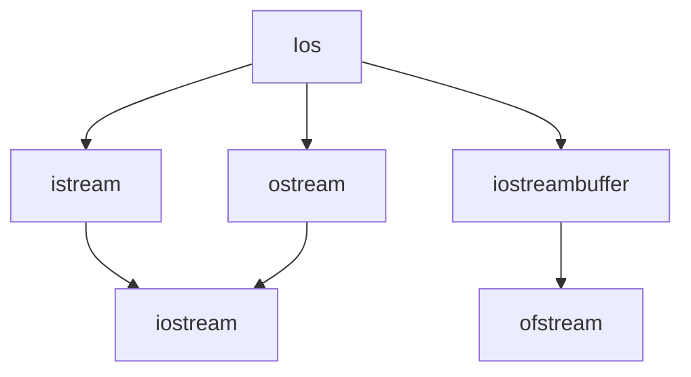

import { Callout } from "nextra/components";

# Pure virtual function and File Handling

## Virtual Function

Member function of the base class that we expect to redefine in the derived class. It is declared using the `virtual` keyword. It cannot have static members.

<Callout>
Cannot have a virtual constructor but can have a virtual destructor.
</Callout>

### Pure Virtual Function (Do-nothing function)

Function declared in the base class that has no definition relative to the base class. It can be defined as:

```cpp
virtual<func_type><func_name>() = 0

virtual void display() = 0;
```

## Binding

Converts identifier into addresses. Linking function definition to function call.

### Early Binding

When compiler acknowledges all the information required to call a function or all its values of the variables during compile time.

### Late Binding

Calling a function or assigning a value to a variable at runtime.

## Defining opening and closing a file

Types of Stream:

1. Input: `ifstream fin;` : Stream class to read from files.
2. Output: `ofstream fout;` : Stream class to write on files.
3. Input/Output: `fstream fio;` : Stream class to both read and write from/to file.

### Opening a File

Using the constructor function of the stream class.

Using the function open.

```cpp
ifstream fin("file", ios::in);
```

### Closing a File

It is closed by disconnecting it with the stream it is associated with.

```cpp
stream_object.close();
```

## Input / Output operations on files

To achieve file handling we need the following steps:

1. Naming a file
2. Opening a file
3. Writing data into the file
4. Reading data from the file
5. Closing the file

### Classes for File Stream Operations

1. Ios
2. Istream
3. Ostream
4. Streambuf
5. Fstreambase
6. Ifstream
7. Ofstream
8. Fstream
9. Filebuf

## Error handling during input/output operations

Error occurs during file handling and C++ has provided built in functions to handle errors during file operations. They are: `int bad()`, `int fail()`, `int good()`, `int eof()`, etc.

## Stream Class Hierarchy for Console Input /Output

Stream Classes in C++ are used to input and output operations on files and io devices. The `iostream.h` library holds all the stream classes in C++.



## Unformatted Input /Output Formatted Input /Output with Ios

### Unformatted Input/Output

Reads single input from the user at the console and it allows to display the value at the console. Unformatted I/O are used for character and string datatype but not for another datatypes.

Example: `getch()`, `getchc()`, `getchar()`, `putchar()`, `gets()`, `puts()`, `putch()`, etc.

### Formatted Input /Output

These function takes multiple input from the user and also displays multiple outputs to the users. Format specifiers can be used, so they are called formatted I/O.

Examples: `printf()`, `scanf()`, `sprintf()`, `sscanf()`, etc.

### Formatted IO using class members

The Ios class function contains few format flags used to format the output. It has format flags like `showpos`, `showbase`, `oct`, `hex`, etc. The format flags are used by the function `self()`.

Function of Ios class used to perform formatted IO in C++ are:

1. `width()`: The width is used to set the required field width. The output will be displayed in the given width.
2. `precision()`: set the number of decimal point to a float value
3. `fill()`: set a character to fill in the blank space of the field
4. `setf()`: used to set various flags for formatting output
5. `unsetf()`: remove the flag setting

### Formatted IO using Manipulators

The `iomanip.h` header file contains several special functions that are used to perform formatted IO operations.

Details of special manipulators functions used to perform formatted IO in C++ are:

1. `setw()`: Equivalent of `width()`
2. `setprecision()`: Equivalent of `precision()`
3. `setfill()`: Equivalent of `fill()`
4. `setiosflags()`: Equivalent of `setf()`
5. `resetiosflags()`: Equivalent of `unsetf()`

The `iomanip.h` also contains the following format flags using in formatted IO in C++.

| Flag | Description |
| --- | --- |
| endl | move the cursor position to the new line |
| ends | print a blank space (null character) |
| dec | set the decimal flag |
| oct | set the octal flag |
| hex | set the hexadecimal flag |
| left | set the left alignment flag |
| right | set the right alignment flag |
| showbase | set the showbase flag |
| noshowbase | set the noshowbase flag |
| showpos | set the showpos flag |
| noshowpos | set the noshowpos flag |
| showpoint | set the showpoint flag |
| noshowpoint | set the noshowpoint flag |

## Member functions and Flags

## Formatting with Manipulators

### Manipulators

They are operators that are used to format the data display.

Two types of manipulators

1. Manipulators with Arguments: requires `iomanip` header.
2. Manipulators without Arguments: requires `iostream` header.
